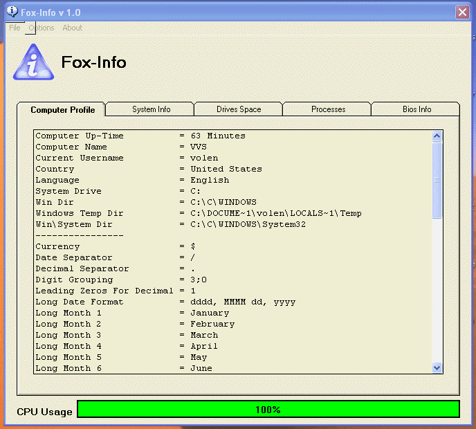



## \[ Computer\-Info v 1\.0 \]

### Description

Fox-Info v 1.1 UPDATED VERSION, this software shows you a lot of informations about your computer:|||| System Info: Processor name, number of processors of your computer, system drive path, wan ip address, local ip address, screen resolution, operating system, total physical memory, available physical memory, total paging file, available paging file, number of running programs, printer name and your DirectX version.|||| Computer Profile: Computer up-time, computer name, current username and a lot of other regional informations.|||| Drives Space: Shows you for each drive on your computer his : (Name, Type, Total size, Free space and Used space).|||| Processes: Shows you all your processes running on your computer, the options "Terminate Selected Process" is now available.|||| BIOS Info: Shows you a lot of informations of your BIOS, such as (Status, BIOS version, BIOS name,...|||| Fox-Info also can create a log file of your computer profile and system info. PLEASE VOTE, I WORKED VERY HARD FOR THIS SOFTWARE, Thank's
 
### More Info
 

             |
---                |---
**Submitted On**   |2005-04-02 13:03:14
**By**             |[Power Of Anubis](https://github.com/Planet-Source-Code/PSCIndex/blob/master/ByAuthor/power-of-anubis.md)
**Level**          |Beginner
**User Rating**    |4.7 (576 globes from 122 users)
**Compatibility**  |VB 6\.0
**Category**       |[Complete Applications](https://github.com/Planet-Source-Code/PSCIndex/blob/master/ByCategory/complete-applications__1-27.md)
**World**          |[Visual Basic](https://github.com/Planet-Source-Code/PSCIndex/blob/master/ByWorld/visual-basic.md)
**Archive File**   |[\[\_Fox\-Info187139432005\.zip](https://github.com/Planet-Source-Code/power-of-anubis-computer-info-v-1-0__1-59801/archive/master.zip)

